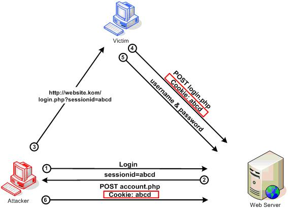

# Authentication

## Problem Statement
Many applications are designed to be used by multiple users. This is particularly common amongst web applications. Different users may have different privileges within the system or access to different data.

In order for this to work, we need to be able to *authenticate* that a user is who he says he is.

## Lesson Objectives
- Authentication Factors
- Passwords
- Authentication Process
- Session Management

## Notes and Examples

> **Authentication** is the process of verification that an individual, entity or website is who it claims to be.

> **Authentication** is the front gate of any secure web application

Authentication is used to establish the identity of your users, and without it, other functions of the site, such as authorization, cannot operate.

Authentication in the context of web applications is commonly performed by submitting a user name or ID and one or more items of private information that only a given user should know.

### Authentication Factors

The ways in which someone may be authenticated fall into three categories, based on what are known as the **factors** of authentication: 

1. something the user ***knows***
2. something the user ***has***
3. something the user ***is***

Security research has determined that for a positive authentication, elements from at least two, and preferably all three, factors should be verified. The three factors (classes) and some of elements of each factor are:

- the **knowledge factors**: Something the user knows (e.g., a password, Partial Password, pass phrase, or personal identification number (PIN), challenge response (the user must answer a question, or pattern), Security question
- the **ownership factors**: Something the user has (e.g., wrist band, ID card, security token, cell phone with built-in hardware token, software token, or cell phone holding a software token)
- the **inherence factors**: Something the user is or does (e.g., fingerprint, retinal pattern, DNA sequence (there are assorted definitions of what is sufficient), signature, face, voice, unique bio-electric signals, or other biometric identifier).

Most web applications require only a user name and password .

When elements representing two factors are required for authentication, the term **two-factor authentication** is applied.  Examples:

- a bankcard (something the user has) and a PIN (something the user knows).
- Business networks may require users to provide a password (knowledge factor) and a pseudorandom number from a security token (ownership factor).

### Passwords
#### Password Strength

> **Entropy** is a measure of how unpredictable a password is.

A key concern when using passwords for authentication is password strength. A "strong" password policy makes it difficult or even improbable for one to guess the password through either manual or automated means. The following characteristics define a strong password:

##### Password Length
Longer passwords provide a greater combination of characters and consequently make it more difficult for an attacker to guess. 

- Passwords shorter than 10 characters are considered to be weak
- Maximum password length should not be set too low, as it will prevent users from creating passphrases. Typical maximum length is 128 characters.

##### Password Complexity
Applications should enforce password complexity rules to discourage easy to guess passwords. 

- Password mechanisms should allow virtually any character the user can type to be part of their password, including the space character. 
- Passwords should, obviously, be case sensitive in order to increase their complexity.

##### Summary

The following are examples of a strong password policy:

- Password must meet at least 3 out of the following 4 complexity rules
  1. at least 1 uppercase character (A-Z)
  2. at least 1 lowercase character (a-z)
  3. at least 1 digit (0-9)
  4. at least 1 special character (punctuation) — do not forget to treat space as special characters too
- at least 10 characters
- at most 128 characters
- not more than 2 identical characters in a row (e.g., 111 not allowed)

[OWASP Authentication Cheat Sheet - Implement Proper Password Strength Controls](https://www.owasp.org/index.php/Authentication_Cheat_Sheet#Implement_Proper_Password_Strength_Controls)

> ##### Exercise
> <a href="#passwordStrengthExercise">Implement Password Strength Controls for Critter</a>


[XKCD](https://xkcd.com/936/)

### Authentication Process

#### Use TLS
The login page and all subsequent authenticated pages must be exclusively accessed over TLS or other strong transport. The initial login page, referred to as the "login landing page", must be served over TLS or other strong transport. *Failure to utilize TLS or other strong transport for the login landing page allows an attacker to modify the login form action, causing the user's credentials to be posted to an arbitrary location.*

> We will not be setting up TLS for our applications as it is outside the scope of this module.  Normally this is something that is handled by infrastructure people rather than application developers.  However, it is important to note that authentication credentials should ***always*** be transmitted over a secure channel.

#### Authentication Error Messages
Incorrectly implemented error messages in the case of authentication functionality can be used for the purposes of user ID and password enumeration. An application should respond (both HTTP and HTML) in a generic manner.

##### Authentication Responses
An application should respond with a generic error message regardless of whether the user ID or password was incorrect. It should also give no indication to the status of an existing account.

###### Incorrect Response Examples
- "Login for User foo: invalid password"
- "Login failed, invalid user ID"
- "Login failed; account disabled"
- "Login failed; this user is not active"

###### Correct Response Example
- "Login failed; Invalid userID or password"

> In the case of Critter, this is somewhat less of a concern as user names are public by the nature of the application and hence an attacker would have no need to attempt to harvest them from the authentication process.

#### Prevent Brute Force Attacks
If an attacker is able to guess passwords without the account becoming disabled due to failed authentication attempts, the attacker has an opportunity to continue with a brute force attack until the account is compromised. Automating brute-force/password guessing attacks on web applications is a trivial challenge. Password lockout mechanisms should be employed that lock out an account if more than a preset number of unsuccessful login attempts are made.

Given that the intent of a password lockout system is to protect from brute-force attacks, a sensible strategy is to lockout accounts for a period of time (e.g., 20 minutes). This significantly slows down attackers, while allowing the accounts to reopen automatically for legitimate users.

>
> **How would a lockout process be implemented**
>


### Session Management
Once a user has been successfully authenticated, we need to keep track of that fact so that we can continue to treat the user as authenticated on subsequent requests.

Since application servers already have implemented the notion of a session, it is quite common to store a user's authentication status in the web application session.  

#### Session Fixation



[View Image](img/owasp_session_fixation.jpg)

Session Fixation is an attack that permits an attacker to hijack a valid user session. The attack explores a limitation in the way the web application manages the session ID, more specifically the vulnerable web application. When authenticating a user, it doesn’t assign a new session ID, making it possible to use an existent session ID. 

The attack consists of:

1. obtaining a valid session ID (e.g. by connecting to the application)
2. inducing a user to authenticate himself with that session ID
3. hijacking the user-validated session by the knowledge of the used session ID. 

Simply put, the idea is to provide a legitimate Web application session ID and try to make the victim's browser use it.

##### Prevention
To prevent Session Fixation, simply create a new session and invalidate the old session after successful login.

[OWASP Session Fixation](https://www.owasp.org/index.php/Session_fixation)

> ##### Exercise
> <a href="#sessionFixationExercise">Prevent Session Fixation</a>

#### Session Expiration
One way to protect a session is to end it after it has been idle for a certain period of time.  This helps to prevent an attacker from brute forcing session ids and also can help in scenarios where a user gets up and walks away from his/her computer without logging out.

##### Tomcat (Java)
The following element in the `web.xml` file can be used to configure timeout.

```
<session-config>
  <session-timeout>30</session-timeout>    <!-- 30 minutes -->
</session-config>
```

##### ASP.NET (C#)
The following element in the `web.config` file can be used to configure timeout.

```xml
<system.web>
    <sessionState timeout="20" />
</system.web>
```

#### Use Cookies Only
Using the web application session to store a user's authentication status effectively makes the session token equivalent to a user's authentication credentials and therefore great care should be taken to protect the session ID.

Most web application server store a user's session id in a browser cookie.  This is good because in the case that HTTPS is being used, the cookie is transmitted securely and the session id is not exposed.

However, in the case that the client does not accept cookies, the application server will often accept the session id as part of the URL using something called "URL rewriting".  This is dangerous in that it exposes the session id.  For this reason, URL rewriting functionality should be disabled:

##### Tomcat (Java)
The following element in the `web.xml` file can be used to limit session tracking to Cookies only.

```
<session-config>
    <tracking-mode>COOKIE</tracking-mode>
</session-config>
```

##### ASP.NET (C#)
The following element in the `web.config` file can be used to limit sesison tracking to Cookies only.

```xml
<system.web>
    <sessionState cookieless="AutoDetect"  />
</system.web>
```

## Instructor Led Exercises

Demonstrate the Authentication Provider in the lecture code and how it is handling the login, registration and authorization checking of users.

- Show the DAL/DAO layer. This is generally the same layer that they saw in the database week.
- Then show the `(I)AuthProvider` interface and show that we can handle other services with an interface, just like the DAL/DAO layer. This lets us be flexible with how we handle auth.
- Then show the `SessionAuthProvider`. This will use the session to manage the logged in user. Emphasize that we don't expect the students to write something like this, but that companies might have solutions like this in place and it's important to be able to use code that they don't understand.
- Show the `AccountController` and how it uses the `AuthProvider`. All real logic for the authentication is handled in the provider, not the controller.
- Show the other Controller to demonstrate how access checks are handled. This can be used by the students in their capstones.
- Implement the login page and registration page. The registration page for Java needs to use the `form` tags form Spring in order to have the validation work.
